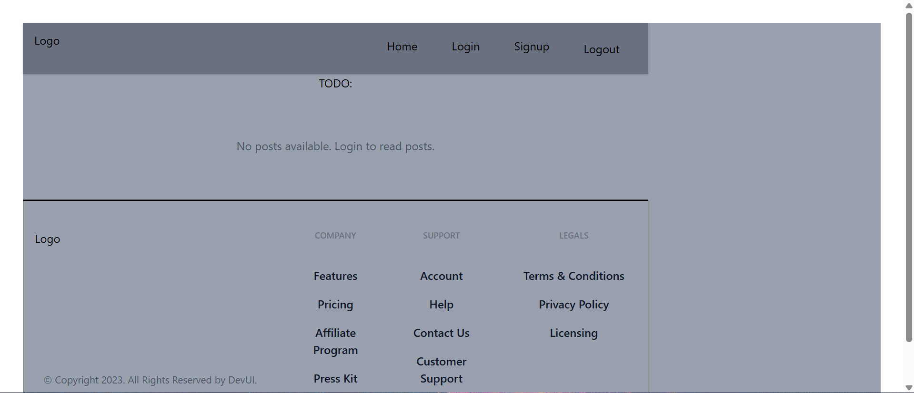

# 📝 AppwriteBlog - Full Stack Blog Application

A full-stack blog application built with **React** on the frontend 
and **Appwrite** handling all backend services — authentication, 
database, and file storage. Demonstrates real-world app development 
beyond static frontends.

## 🔗 Live Demo
[View Live →](https://appwrite-blog-app-chi.vercel.app)

## 📸 Screenshot


## 🛠️ Tech Stack

| Frontend | Backend |
|---|---|
| React + Vite | Appwrite |
| Redux Toolkit | Appwrite Auth |
| React Router DOM | Appwrite Database |
| TailwindCSS | Appwrite Storage |

## ✨ Features
- User authentication (signup / login / logout)
- Create, edit and delete blog posts
- Image upload and storage
- Protected routes for authenticated users
- Rich text editor for post content
- Fully responsive design

## ⚙️ Getting Started

### 1. Clone the repo
```bash
git clone https://github.com/HarisShahnawaz/AppwriteBlogApp
cd AppwriteBlogApp
```

### 2. Set up environment variables
```bash
cp .env.sample .env
```
Fill in your Appwrite project credentials in `.env`

### 3. Run the app
```bash
npm install
npm run dev
```

## 🔐 Environment Variables
```
VITE_APPWRITE_URL=
VITE_APPWRITE_PROJECT_ID=
VITE_APPWRITE_DATABASE_ID=
VITE_APPWRITE_COLLECTION_ID=
VITE_APPWRITE_BUCKET_ID=
```

> ⚠️ Never commit your `.env` file — it's already in `.gitignore`

## 📬 Contact
**Haris Shahnawaz** — [LinkedIn](https://www.linkedin.com/in/haris-shahnawaz-670aa8291/) | [Email](mailto:harisshahnawaz97@gmail.com)
